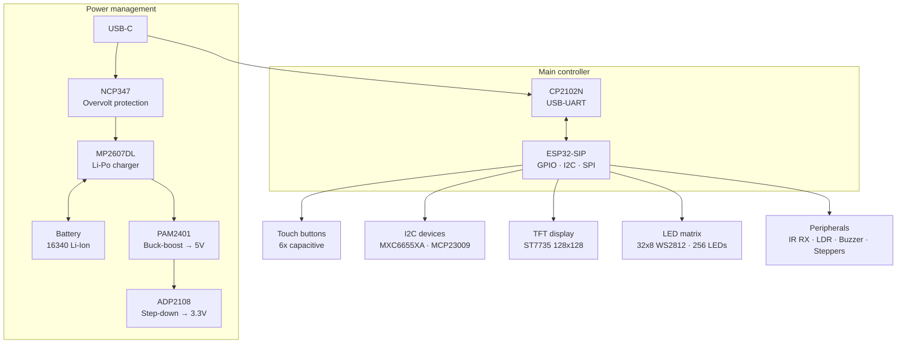
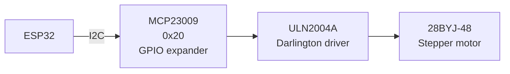
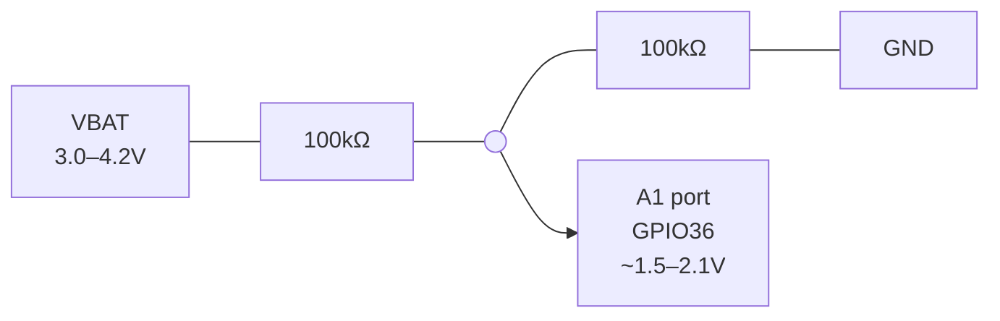

Complete hardware documentation for the ED1 Citilab Board Rev 2.3.

## Board overview

The ED1 is an ESP32-based educational development board designed by [Citilab Edutec](https://citilab.eu). It integrates multiple peripherals for learning embedded systems and IoT development.

### Specifications

| Parameter   | Value                         |
| ----------- | ----------------------------- |
| MCU         | ESP32-SIP (dual-core, 240MHz) |
| Flash       | Integrated in SIP             |
| RAM         | 520KB SRAM                    |
| WiFi        | 2.4GHz 802.11 b/g/n           |
| Bluetooth   | BLE 4.2                       |
| Power Input | USB-C (5V)                    |
| Battery     | 16340/CR123A Li-Ion (3.7V)    |
| Dimensions  | ~80mm x 60mm                  |

## Block diagram



## Components

### Main controller

| Component | Part Number | Description                    |
| --------- | ----------- | ------------------------------ |
| U5        | ESP32-SIP   | Main MCU with integrated flash |

### Power management

| Component | Part Number   | Function                   | Notes                        |
| --------- | ------------- | -------------------------- | ---------------------------- |
| J1        | 105450-0101   | USB-C Connector            | Power + data                 |
| U2        | NCP347        | USB Overvoltage Protection | Protects against >5.5V       |
| U1        | MP2607DL-LF-Z | Li-Po Charger              | 1A charge rate, load sharing |
| IC1       | PAM2401SCADJ  | 5V Buck-Boost              | From battery to 5V           |
| U9        | ADP2108       | 3.3V Step-Down             | System 3.3V rail             |
| Q1, Q2    | NMOS/PMOS     | Battery Protection         | Reverse polarity protection  |
| BT1       | 16340/CR123A  | Battery Holder             | 3.7V Li-Ion                  |

### Communication

| Component | Part Number | Function       | Notes                    |
| --------- | ----------- | -------------- | ------------------------ |
| U6        | CP2102N     | USB to UART    | Auto-programming support |
| ANT1      | PRO-OB-440  | 2.4GHz Antenna | PCB antenna              |

### Display

| Component  | Part Number   | Interface | Notes                    |
| ---------- | ------------- | --------- | ------------------------ |
| TFT1       | TFT-Z144SN005 | SPI       | 1.44" 128x128 ST7735     |
| LED Matrix | WS2812X       | GPIO12    | 32x8 (256 LEDs) external |

### Sensors

| Component | Part Number   | Interface    | Address | Notes                                         |
| --------- | ------------- | ------------ | ------- | --------------------------------------------- |
| U13       | MXC6655XA     | I2C          | 0x15    | 3-axis accelerometer                          |
| Q5        | ALS-PT19-315C | ADC (GPIO34) | -       | Light sensor                                  |
| U12       | TSOP75438TT   | GPIO35       | -       | IR receiver 38kHz (Rev 2.3); GPIO33 (Rev 1.0) |

### Input/Output

| Component | Part Number     | Function          | Notes                    |
| --------- | --------------- | ----------------- | ------------------------ |
| T1-T6     | Capacitive pads | Touch buttons     | 6 buttons around display |
| SW1       | JS102011SAQN    | Power switch      | Slide switch, no GPIO    |
| SW2       | PTS820          | Reset button      | Hardware reset           |
| U11       | MCP23009        | I2C GPIO Expander | 8 additional GPIO @ 0x20 |
| U7, U8    | ULN2004A        | Stepper Drivers   | For 28BYJ-48 motors      |
| U10       | PAM8301AAF      | Audio Amplifier   | For buzzer/speaker       |
| Z1        | MLT-8530        | Buzzer            | Driven by amplifier      |

### Connectors

| Connector | Type          | Pins | Function                 |
| --------- | ------------- | ---- | ------------------------ |
| J2-J10    | 2.54mm Header | 4    | GPIO expansion           |
| J11       | Grove         | 4    | I2C Grove connector      |
| M1, M2    | JST-XH        | 5    | Stepper motor (28BYJ-48) |

## Stepper motor control

The ED1 board includes built-in support for two 28BYJ-48 stepper motors via the MCP23009 I2C GPIO expander and ULN2004A Darlington driver arrays.

### Signal path



### MCP23009 to motor pin mapping

| MCP23009 GPIO | Signal | ULN2004A | Motor | Coil |
| ------------- | ------ | -------- | ----- | ---- |
| GP0           | I2D    | U8 pin 1 | M2    | D    |
| GP1           | I2C    | U8 pin 2 | M2    | C    |
| GP2           | I2B    | U8 pin 3 | M2    | B    |
| GP3           | I2A    | U8 pin 4 | M2    | A    |
| GP4           | I1D    | U7 pin 4 | M1    | D    |
| GP5           | I1C    | U7 pin 3 | M1    | C    |
| GP6           | I1B    | U7 pin 2 | M1    | B    |
| GP7           | I1A    | U7 pin 1 | M1    | A    |

### 28BYJ-48 specifications

- **Step angle**: 5.625° (64 steps per motor revolution)
- **Gear ratio**: 64:1
- **Steps per output revolution**: 512 (full-step mode) or 4096 (half-step mode)
- **Operating voltage**: 5V DC
- **Drive method**: Full-step sequence (4 phases) - matching MicroBlocks implementation

### MCP23009 initialization

The MCP23009 requires specific register initialization for motor control:

| Register | Address | Value  | Purpose                              |
| -------- | ------- | ------ | ------------------------------------ |
| IODIR    | 0x00    | 0x00   | Set all 8 pins as outputs            |
| GPPU     | 0x06    | 0xFF   | Enable internal pull-ups (required!) |
| GPIO     | 0x09    | varies | Motor coil patterns                  |

**Important**: The GPPU register (pull-ups) must be enabled for reliable motor operation. Without this, the ULN2004A drivers may not receive proper signal levels.

### Full-step sequence

The step sequence matches the [MicroBlocks](https://microblocks.fun/) "ED1 Stepper Motor" library, which was used as the reference implementation. MicroBlocks is the official programming environment for the ED1 board.

Source: [MicroBlocks ED1 Library](https://wiki.microblocks.fun/en/extension_libraries/ed1)

| Phase | Pattern | Motor 1 (upper nibble) | Motor 2 (lower nibble) |
| ----- | ------- | ---------------------- | ---------------------- |
| 0     | A+D     | 0x90                   | 0x09                   |
| 1     | A+B     | 0xC0                   | 0x0C                   |
| 2     | B+C     | 0x60                   | 0x06                   |
| 3     | C+D     | 0x30                   | 0x03                   |

Timing: ~2ms between steps (1500µs in MicroBlocks)

### ESPHome usage

Include the stepper package:

```yaml
packages:
  stepper: !include packages/stepper.yaml
```

This exposes Home Assistant entities for controlling both motors:

- **Number entities**: Set step count (-4096 to +4096) for precise positioning
- **Button entities**: Quick rotation (CW/CCW 512 steps = full rotation)
- **Stop button**: Immediately stop motors and power down coils

The package uses direct I2C register writes (not the ESPHome mcp23008 component) for reliable timing and compatibility with the MicroBlocks implementation.

## Power system

### Power sources

1. **USB-C (5V)**: Primary power, also charges battery
2. **Battery (3.7V)**: 16340/CR123A Li-Ion cell

### Power rails

- **VBUS**: Raw USB voltage (5V)
- **VDD_IN**: After overvoltage protection
- **VBAT**: Battery voltage (3.0-4.2V)
- **VDD5**: Regulated 5V (from buck-boost)
- **VDD33**: Regulated 3.3V (system rail)
- **VDD3A**: Analog 3.3V (for ESP32)

### Charging

- **Charge IC**: MP2607DL with load sharing
- **Charge Rate**: 1000mA (set by R6)
- **Status LEDs**: STAT1, STAT2, DONE, CHR

### Battery protection

When battery is inserted with wrong polarity, Q1 and Q2 transistors isolate the battery from the system, preventing damage.

### Power switch (SW1)

The slide switch on the right side of the board (JS102011SAQN) connects/disconnects the battery from the power circuit. This is a purely mechanical switch with no GPIO connection.

### Battery monitoring limitations

The ED1 board has **no built-in battery monitoring capability**. The following cannot be detected programmatically:

| Feature            | Status        | Reason                             |
| ------------------ | ------------- | ---------------------------------- |
| Battery voltage    | Not available | VBAT not connected to any ADC pin  |
| Charging status    | Not available | STAT1/STAT2 only connected to LEDs |
| USB connected      | Not available | VBUS not connected to any GPIO     |
| Power switch state | Not available | Switch is mechanical only          |

The charger status signals (STAT1, STAT2, DONE, CHR) from the MP2607DL are routed only to LED drivers (NL7SZ97), not to ESP32 GPIOs.

#### Hardware modification for battery monitoring

To read battery voltage, add an external voltage divider to an analog expansion port:



This divides the 3.0-4.2V battery range to ~1.5-2.1V, safe for the ESP32 ADC. ESPHome configuration:

```yaml
sensor:
  - platform: adc
    pin: GPIO36
    name: "Battery Voltage"
    attenuation: 11db
    filters:
      - multiply: 2.0 # Compensate for voltage divider
    update_interval: 60s
```

## Datasheets

Component datasheets are included in `docs/datasheets/`:

- [MXC6655XA Accelerometer](https://github.com/glifocat/ed1-hoas/blob/main/docs/datasheets/MXC6655XA-accelerometer.pdf)
- [PAM2401 Buck-Boost](https://github.com/glifocat/ed1-hoas/blob/main/docs/datasheets/PAM2401-buck-boost.pdf)
- [CP2102N USB-UART](https://github.com/glifocat/ed1-hoas/blob/main/docs/datasheets/CP2102N-usb-uart.pdf)

## Hardware revisions

This documentation primarily covers **ED1 Rev 2.3**, but packages have been tested on both revisions.

### Revision differences

| Component          | Rev 1.0           | Rev 2.3            |
| ------------------ | ----------------- | ------------------ |
| Accelerometer      | LIS3DH (0x19)     | MXC6655XA (0x15)   |
| I/O Expander       | MCP23017 (0x20)   | MCP23009 (0x20)    |
| Stepper Driver ICs | ULN2004A          | ULN2004A           |
| IR Emitter         | GPIO32 (Untested) | Not available      |
| IR Receiver        | GPIO33            | GPIO35 (Tested OK) |

### Compatibility notes

- **Core packages** (display, buttons, sensors, buzzer, etc.) work on both revisions.
- **Stepper package** (`packages/stepper.yaml`) is designed for Rev 2.3's MCP23009.
- **IR Features**:
  - **Rev 2.3**: Receiver works reliably on GPIO35. No emitter hardware.
  - **Rev 1.0**: Receiver on GPIO33, emitter on GPIO32 (both untested in this project).

- **Accelerometer** is not yet implemented in ESPHome packages

### Identifying your revision

Check the I2C scan on boot (in ESPHome logs):

- `0x15` + `0x20` = Rev 2.3 (MXC6655XA + MCP23009)
- `0x19` + `0x20` = Rev 1.0 (LIS3DH + MCP23017)

The original KiCad design files and full schematics are available from [Citilab](https://citilab.eu).
